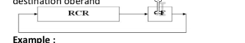

# Table of Contents

- [Data Transfer Instructions](#data-transfer-instructions)
- [Flags Related Instructions](#flags-related-instructions)
- [Arithmetic Instrutions](#arithmetic-instructions)
- [Logic Instructions](#logic-instructions)
- [Shift Instructions](#shift-instructions)
- [Flags](#how-the-flags-are-set)


## DATA TRANSFER INSTRUCTIONS

### THE MOV INSTRUCTION

```asm
    MOV dest, src
```

### Algo

```c
    dest = src
```

### Note

+ moves a the value of the src in the dest     

### Conditions


+ sizeof(dest) = sizeof(src)

+ dest != cs, ip
    
+ dest and src both segment registers not allowed
 
+ dest = seg reg and src = imm value is not allowed

+ memory to memory data transfer isn't allowed

### Results
    
+ no flags changed

#

### THE LEA INSTRUCTION

```asm 
    LEA dest, src
```

### Algo
    
```c
    dest = &src
```  

### Note

+ loads the effective address of the src in the dest

### Conditions


+ typeof(dest) = reg (word)

+ typeof(src) = memory slot
 
### Results
    
+ no flags changed

#

### Equivalent instruction

```asm
    MOV dest, OFFSET src
```
    

### THE XCHG INSTRUCTION

```asm
    XCHG dest, src
``` 

### Note

+ makes an exchange between the values of the dest and src

### Algo
    
```c
    temp = dest
    dest =  src    
    src = temp  
```

### Conditions


+ sizeof(dest) = sizeof(src)

+ both operands must satisfy the conditions on the dest in the [MOV instruction](#the-mov-instruction)
 
### Results
    
+ no flags changed

#

### THE PUSH INSTRUCTION

```asm 
    PUSH src
```

### Algo

```c
    sp -= 2
    *(ss + sp) = src 
```

### Conditions


+ sizeof(src) = word

+ src can be of any type (sreg included)

### Results
    
+ no flags changed

#

### THE POP INSTRUCTION

```asm
    POP dest
```

### Algo
    
```c
    dest = *(ss + sp)
    sp += 2 
```

### Conditions

+ sizeof(dest) = word

+ typeof(dest) != imm value
 
### Results
    
+ no flags changed

#

### THE PUSHA INSTRUCTION

```asm
    PUSHA
```

### Note

+ pushes all the general purpose registers to the stack

### Algo
    
```c
    push(AX) 
    push(CX)
    push(DX) 
    push(BX)
    push(SP)
    push(BP)
    push(SI)
    push(DI)
```

### Note

+ the value of the sp register pushed to the stack is the it's value before performing the push instruction 

```c
    sp_pushed = current_sp - 5 * sizeof(word)
```

### Results
    
+ no flags changed

#

### THE POPA INSTRUCTION

```asm
    POPA
```

### Note

+ pops all the general purpose registers out of the stack

### Algo
    
```c
    pop(DI)
    pop(SI)
    pop(BP)
    pop(xx) // ( SP value is ignored )
    pop(BX)
    pop(DX)
    pop(CX)
    pop(AX)
```

### Note

+ the sp value is ignored, it will be popped out of the stack but the popped value won't change the the sp value

### Results
    
+ no flags changed

#

### THE CBW INSTRUCTION

```asm
    CBW
```

### Algo

```c
    // exemple value of ax
    int ax = 0xFFFF;

    // get the low byte of ax => al
    int al = ax & 0xFF;

    // get the most signifant bit of al
    int msb_of_low_byte = (al >> 7) & 1;

    // get ah using the msb
    
    int ah = msb_of_low_byte == 1 ? 0xFF : 0;

    // get ax = ah - al
    ax = ah << 8 | al;
```

### Note

+ convert a byte to a word preserving the same value
+ works only with ax (al -> ax)
+ if the msb of al = 1 => ah = 0xFF else ax = 0

### Results
    
+ no flags changed

#

### THE CWD INSTRUCTION

```asm
    CWD
```

### Algo

```c
    // exemple value of ax and dx
    int ax = 0xFFFF;    

    // get the most signifant bit of ax
    int msg_of_ax = (ax >> 15) & 1;

    // get dx using the msb
    
    int dx = msb_of_ax == 1 ? 0xFFFF : 0;

    // dx-ax is the result!
```

### Note

+ convert a word to a double-word preserving the same value
+ works only with ax (ax -> dx)
+ if the msb of ax = 1 => dx = 0xFFFF else dx = 0

### Results
    
+ no flags changed

#

## FLAGS RELATED INSTRUCTIONS

### THE CLC INSTRUCTION

```asm
    CLC
```

### Note

+ set the carry flag to 0 

### Results
    
+ carry flag changed

#

### THE STC INSTRUCTION

```asm
    STC
```

### Note

+ set the carry flag to 1 

### Results
    
+ carry flag changed

#

### THE CMC INSTRUCTION

```asm
    CMC
```

### Algo 

```c
    // exemple value of cf
    bool cf = 0;

    cf = cf == 0 ? 1 : 0;
```

### Note

+ complements the carry flag

### Results
    
+ carry flag changed

#

### THE CLD INSTRUCTION

```asm
    CLD
```

### Note

+ set the direction flag to 0 

### Results
    
+ direction flag changed

#

### THE STD INSTRUCTION

```asm
    STD
```

### Note

+ set the direction flag to 1

### Results
    
+ direction flag changed

#


### THE CLI INSTRUCTION

```asm
    CLI
```

### Note

+ set the interrupt flag to 0 

### Results
    
+ interrupt flag changed

#

### THE STI INSTRUCTION

```asm
    STI
```

### Note

+ set the interrupt flag to 1

### Results
    
+ interrupt flag changed

#

### THE LAHF INSTRUCTION

```asm
    LAHF
```

### Note

+ copies the low byte of the flags reg and move it to ah

### Results
    
+ no flag changes

#

### THE SAHF INSTRUCTION

```asm
    SAHF
```

### Note

+ copies the ah reg and move it to the low byte of the flags reg

### Results
    
+ SF, ZF, AF, PF, CF Lchanges

#

### THE PUSHF INSTRUCTION

```asm
    PUSHF
```

### Note

+ push the flags reg to the stack

### Results
    
+ no flag changes

#

### THE POPF INSTRUCTION

```asm
    POPF
```

### Note

+ pop the stack and move the popped value to the flags reg

### Results
    
+ all flags changes

#


## ARITHMETIC INSTRUCTIONS

### THE ADD INSTRUCTION

```asm
    ADD dest, src
```

### Algo 

```c
    dest += src
```

### Note

+ make addition between src and dest and store the result in dest

### Conditions

+ sizeof(dest) == sizeof(src)
+ both dest and src can not be of type sreg
+ typeof(dest) == typeof(src) == memory isn't allowed

### Results
    
+ CF, AF, PF, ZF, SF, OF changes

### THE ADC INSTRUCTION

```asm
    ADC dest, src
```

### Algo 

```c
    dest += src + carry
```

### Note

+ makes the addition betwee the src and the dest and adding the current value of the carry flag and stores the result in the dest operand

### Conditions

+ same conditions as [ADD instruction](#the-add-instruction)

### Results
    
+ CF, AF, PF, ZF, SF, OF changes


### THE SUB INSTRUCTION

```asm
    SUB dest, src
```

### Algo 

```c
    dest -= src
```

### Note

+ makes a substraction between the dest and src and stores the result value in dest

### Conditions

+ same conditions as [ADD instruction](#the-add-instruction)

### Results
    
+ CF, AF, PF, ZF, SF, OF changes

### THE SBB INSTRUCTION

```asm
    SBB dest, src
```

### Algo 

```c
    dest = dest  - src - carry
```

### Note

+ makes a substraction between the dest and src and the current value of the carry flag and stores the result value in dest

### Conditions

+ same conditions as [ADD instruction](#the-add-instruction)

### Results
    
+ CF, AF, PF, ZF, SF, OF changes

### THE INC INSTRUCTION

```asm
    INC dest
```

### Algo 

```c
    dest++
```

### Note

+ add the value 1 to the dest value and store the result back in dest

+ this instruction does not touch the carry flag  (very imporatant)

### Conditions

+ typeof(dest) == memory or reg

### Results
    
+ AF, PF, ZF, SF, OF changes

### THE DEC INSTRUCTION

```asm
    DEC dest
```

### Algo 

```c
    dest--
```

### Note

+ add the value -1 to the dest value and store the result back in dest

+ this instruction does not touch the carry flag  (very imporatant)

### Conditions

+ typeof(dest) == memory or reg

### Results
    
+ AF, PF, ZF, SF, OF changes


### THE MUL INSTRUCTION

```asm
    MUL src
```

### Algo 

```c
    // if sizeof(src) == 8 bits
    ax = al * src

    // if sizeof(src) == 16 bits
    dx-ax = ax * src
```

### Note

+ makes the unsigned multiplication
+ we have the following rule:
    + CF = OF = 1 if the result cannot be stored in the src operand
    + else:  CF = OF = 0 

+ src operand can be either ax or dx-ax

### Conditions

+ typeof(src) == memory or reg

### Results
    
+ CF, OF changes

### THE IMUL INSTRUCTION

```asm
    IMUL src
```

### Note

+ same as the [MUL instruction](#the-mul-instruction) but it makes the signed multiplication

### Results
    
+ CF, OF changes

### THE DIV INSTRUCTION

```asm
    DIV src
```
### Algo 

```c
    // if sizeof(src) == 8 bits
    al = ax / src
    ah = ax % src

    // if sizeof(src) == 16 bits
    ax = dx-ax / src
    dx = dx-ax % src
```

### Note

+ performs the unsigned division between the dest and the src

### Results

+ no flag will get changed

### THE IDIV INSTRUCTION

```asm
    IDIV src
```
### Algo 

+ same as the  [DIV instruction](#the-div-instruction)

### Note

+ performs the signed division between the dest and the src

+ signed division means that it will take into account the signed representation of both operands

+ 0FFh => 255 unsigned but -1 in signed (it will take -1)

+ the rest of the division will get the same sign as the dest operand (important)

### Results

+ no flag will get changed

### THE NEG INSTRUCTION


```asm
    NEG dest
```

### Algo

```asm
    NOT dest
    INC dest
```

### Note
 
+ performs the 2's complement of the operand given

### Condition

+ typeof(dest) == memory or reg

### Results

+ CF, PF, AF, ZF, SF, OF are all changed

### INT CMP INSTRUCTION

```asm 
    CMP DEST, SRC
```

### Algo 

```asm
    PUSH DEST
    SUB DEST, SRC
    POP DEST
```

### Note

+ this instruction basically makes the substraction between the dest and the src without the storing the value back in dest 
(it just sets the flags according to the result)

### Results

+ CF, PF, AF, ZF, SF, OF are all changed

## LOGIC INSTRUCTIONS

### THE AND INSTRUCTION

```asm
    AND dest, src
```
### Algo

```c
    dest = dest & src;
```

### Note

+ it performs the logical and between the dest and the src and stores the result back in the dest

+ CF = OF = 0 (this is done by this instruction)

+ kind of operands is the same as the [ADD instruction](#the-add-instruction)

### Results

+ PF, ZF, SF are all affected
+ CF, OF are cleared

### THE OR INSTRUCTION

```asm
    OR dest, src
```
### Algo

```c
    dest = dest | src;
```

### Note

+ it performs the logical or between the dest and the src and stores the result back in the dest

+ CF = OF = 0 (this is done by this instruction)

+ kind of operand is the same as the [ADD instruction](#the-add-instruction)

### Results

+ PF, ZF, SF are all affected
+ CF, OF are cleared

### THE XOR INSTRUCTION


```asm
    XOR dest, src
```
### Algo

```c
    dest = dest ^ src;
```

### Note

+ it performs the logical xor between the dest and the src and stores the result back in the dest

+ CF = OF = 0 (this is done by this instruction)

+ kind of operands is the same as the [ADD instruction](#the-add-instruction)

### Results

+ PF, ZF, SF are all affected
+ CF, OF are cleared

### THE NOT INSTRUCTION

```asm
    NOT dest
```
### Algo

```c
    dest = ~dest
```

### Note

+ it inverses all the bits of the given operand and stores the result back in the operand

+ typeof(dest) == memory or reg

### Results

+ no flag will be changed

### THE TEST INSTRUCTION

```asm
    TEST dest, src
```
### Algo

```asm
    PUSH dest
    AND dest, src
    POP dest   
```

### Note

+ it makes the logical and between the dest and src but without changing the value of dest (it just sets the flags, same as [CMP instruction](#int-cmp-instruction))

+ CF = OF = 0 (this is done by this instruction)

+ kind of operands is the same as the [ADD instruction](#the-add-instruction)

### Results

+ PF, ZF, SF are all affected
+ CF, OF are cleared

## SHIFT INSTRUCTIONS

+ Note
    + the following instructions all have the same op code syntax

    ```asm
        INST dest, counter
    ```

    + they all affect the same flags which are the CF and OF

    + after performing the instruction (shift or rotation), the overflowed bit is sent to the carry flag, and if the dest operand changes its sign after performing the instruction then the OF will be set

### THE RCL INSTRUCTION

### Note

+ it performs a left rotation with carry

    

### THE RCR INSTRUCTION

### Note

+ it performs a right rotation with carry

    


### THE ROL INSTRUCTION

### Note

+ it performs a left rotation

    

### THE ROR INSTRUCTION

### Note 

+ it performs a right rotation

    

### THE SHL/SAL INSTRUCTION

### Note

+ it performs a shift to the left (always add 0 at the lower bit)

    

### THE SHR INSTRUCTION

### Note

+ it performs a shift to the right (always add 0 at the higher bit)

    

### THE SAR INSTRUCTION

### Note

+ it performs a shift to the right (always add the same pervious higher bit at the higher bit)

    

## Note

+ the shift operantion is used to perform multiplication and division by 2^(counter)


## HOW THE FLAGS ARE SET

### CARRY FLAG

+ if the operation made between the operands can not be stored in a certain number of bits then the carry flag will be set to indicate that the result value isn't true

+ for exemple:

```
     1010 1001
   + 
     0111 0010
    -----------
   1 0001 1011
```

+ here we see that the result value can not be store in 8 bits which will generate a carry at the end of the operation then CF = 1

### AUXILARY FLAG

+ if a carry is generated after applying the operation on the first nibble (4 bits) of both operands then the auxilary flag will be set

+ for exemple:

```
    1010 1001  first_operand
   +
    0000 1000  second_operand
    ----------
    1011 0001
```

+ here the addition between the first nibble of first_operand and the second_operand generates a carry (1 + 1 = 10) then the AF will be set

### PARITY FLAG

+ the parity flag is set as following:

    + if the result has an even number of 1's in the low nibble then the PF = 1
    + else PF = 0

+ exemples:

    + the value: 1001 1111 1011 1010 => PF = 1 because the low nibble 1010 contains an even number of 1's
    + the value: 1001 1111 1011 0001 => PF = 0 because the low nibble 0001 contains an odd number of 1's

### SIGN FLAG

+ if the result is negative (most signifact bit = 1) then SF = 1
+ else SF = 0

### ZERO FLAG

+ if the result == 0 then ZF = 1
+ else ZF = 0

### OVERFLOW FLAG

the overflow flag follows the next rule:

+ (positive operand) + (positive operand) = (negative operand) => OF = 1 (indicating that the last calculation is false)

+ (negative operand) + (negative operand) = (positive operand) => OF = 1 (indicating that the last calculation is false)

+ (positive operand) - (negative operand) = (negative operand) => OF = 1 (indicating that the last calculation is false)

+ (negative operand) - (positive operand) = (positive operand) => OF = 1 (indicating that the last calculation is false)

